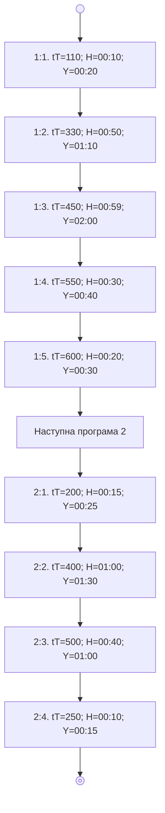

```mermaid
flowchart TD
  idStart@{ shape: sm-circ, label: "Start" }
  idStop@{ shape: framed-circle, label: "Stop" }
  p1_s1[1:1. tT=110; H=00:10; Y=00:20]
  idStart --> p1_s1
  p1_s2[1:2. tT=330; H=00:50; Y=01:10]
  p1_s1 --> p1_s2
  p1_s3[1:3. tT=450; H=00:59; Y=02:00]
  p1_s2 --> p1_s3
  p1_s4[1:4. tT=550; H=00:30; Y=00:40]
  p1_s3 --> p1_s4
  p1_s5[1:5. tT=600; H=00:20; Y=00:30]
  p1_s4 --> p1_s5
  nextProgram_2[Наступна програма 2]
  p1_s5 --> nextProgram_2
  p2_s1[2:1. tT=200; H=00:15; Y=00:25]
  nextProgram_2 --> p2_s1
  p2_s2[2:2. tT=400; H=01:00; Y=01:30]
  p2_s1 --> p2_s2
  p2_s3[2:3. tT=500; H=00:40; Y=01:00]
  p2_s2 --> p2_s3
  p2_s4[2:4. tT=250; H=00:10; Y=00:15]
  p2_s3 --> p2_s4
  p2_s4 --> idStop
```
